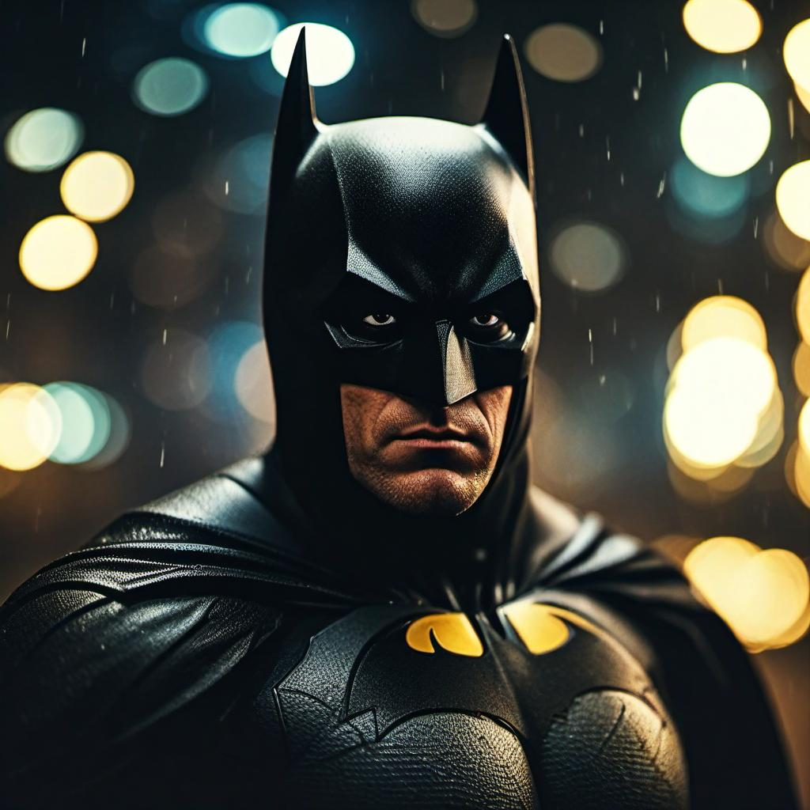
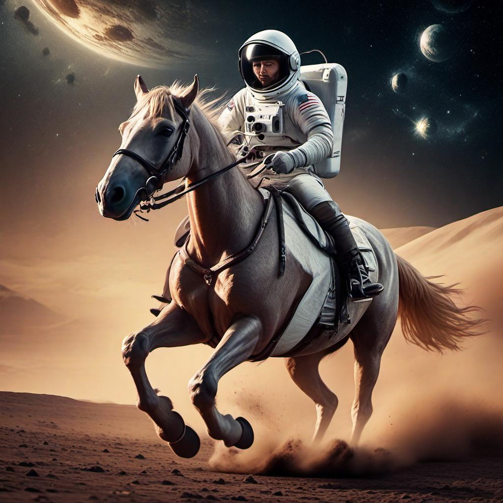
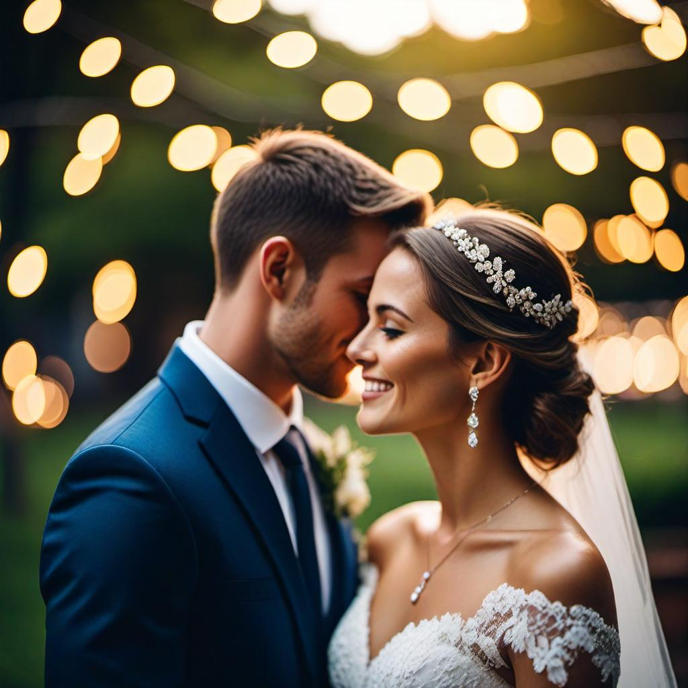
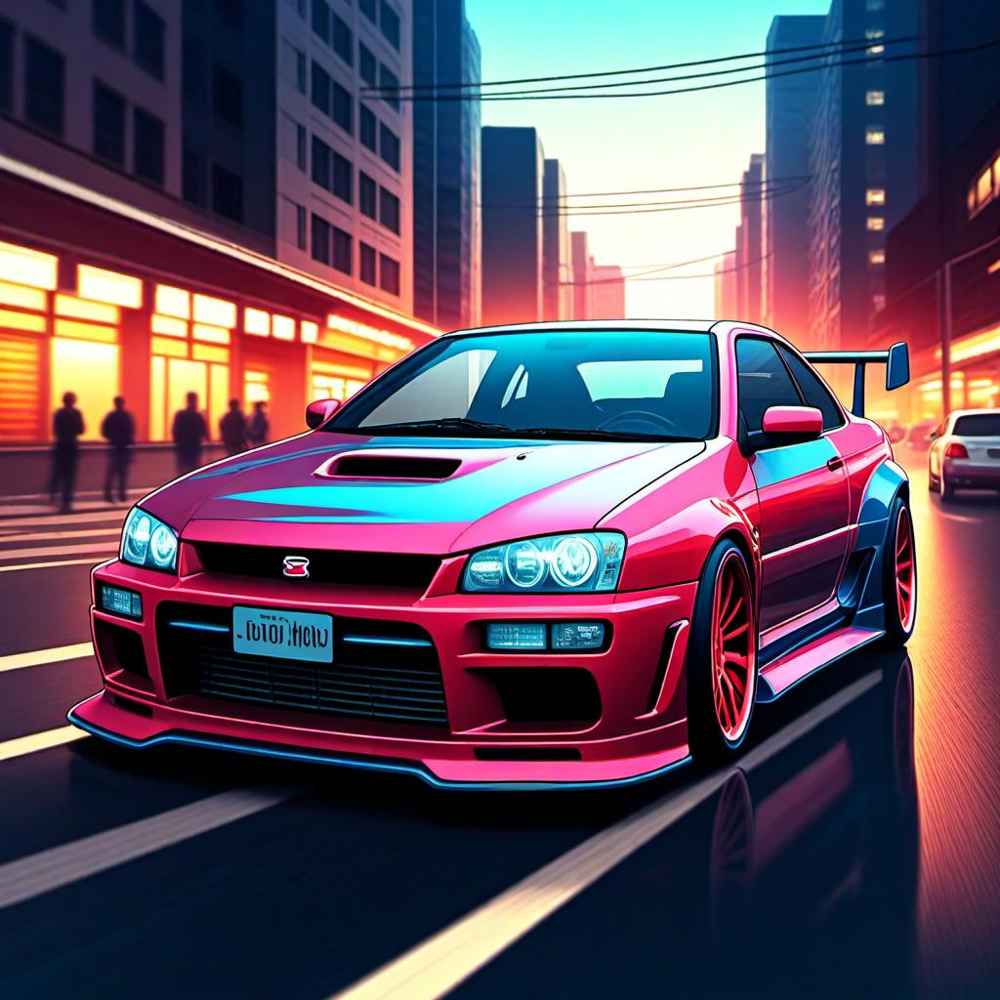

# TLCM: Training-efficient Latent Consistency Model for Image Generation with 2-8 Steps

<p align="center">
   📃 <a href="https://arxiv.org/abs/2406.05768" target="_blank">Paper</a> • 🤗 <a href="https://huggingface.co/AIGCer-OPPO/TLCM" target="_blank">Checkpoints</a> 
</p>

<!-- **TLCM: Training-efficient Latent Consistency Model for Image Generation with 2-8 Steps** -->

Our method accelerates LDMs via data-free multistep latent consistency distillation (MLCD), and data-free latent consistency distillation is proposed to efficiently guarantee the inter-segment consistency in MLCD. 

Furthermore, we introduce bags of techniques, e.g., distribution matching, adversarial learning, and preference learning, to enhance TLCM’s performance at few-step inference without any real data.

TLCM demonstrates a high level of flexibility by enabling adjustment of sampling steps within the range of 2 to 8 while still producing competitive outputs compared
to full-step approaches.

- [Install Dependency](#install-dependency)
- [Example Use](#example-use)
- [Art Gallery](#art-gallery)
- [Addition](#addition)
- [Citation](#citation)

## Install Dependency

```
pip install diffusers 
pip install transformers accelerate
```

## Example Use

We provide an example inference script in the directory of this repo. 
You should download the Lora path from [here]() and use a base model, such as [SDXL1.0](https://huggingface.co/stabilityai/stable-diffusion-xl-base-1.0) , as the recommended option.
After that, you can activate the generation with the following code:
```
python inference.py --prompt {Your prompt} --output_dir {Your output directory} --lora_path {Lora_directory} --base_model_path {Base_model_directory} --infer-steps 4
```
More parameters are presented in paras.py. You can modify them according to your requirements.

## Art Gallery

Here we present some examples with different samping steps.
<div style="display: flex; justify-content: space-around; text-align: center;">
    <div style="text-align: center;">
        
    </div>
    <div style="text-align: center;">
        
    </div>
    <div style="text-align: center;">
        
    </div>
    <div style="text-align: center;">
        
    </div>
</div>
<p style="text-align: center;">2-Steps Sampling.</p>
<div style="display: flex; justify-content: space-around; text-align: center;">
    <div style="text-align: center;">
        
    </div>
    <div style="text-align: center;">
        
    </div>
    <div style="text-align: center;">
        
    </div>
    <div style="text-align: center;">
        
    </div>
</div>
<p style="text-align: center;">3-Steps Sampling.</p>
<div style="display: flex; justify-content: space-around; text-align: center;">
    <div style="text-align: center;">
        
    </div>
    <div style="text-align: center;">
        
    </div>
    <div style="text-align: center;">
        
    </div>
    <div style="text-align: center;">
        
    </div>
</div>
<p style="text-align: center;">4-Steps Sampling.</p>
<div style="display: flex; justify-content: space-around; text-align: center;">
    <div style="text-align: center;">
        
    </div>
    <div style="text-align: center;">
        
    </div>
    <div style="text-align: center;">
        
    </div>
    <div style="text-align: center;">
        
    </div>
</div>
<p style="text-align: center;">8-Steps Sampling.</p>

## Addition

We also provide the latent lpips model [here](https://huggingface.co/AIGCer-OPPO/TLCM). 
More details are presented in the paper.

## Citation

```

```