# TLCM: Training-efficient Latent Consistency Model for Image Generation with 2-8 Steps

<p align="center">
   📃 <a href="https://arxiv.org/html/2406.05768v5" target="_blank">Paper</a> • 
   🤗 <a href="https://huggingface.co/OPPOer/TLCM" target="_blank">Checkpoints</a> 
</p>

<!-- **TLCM: Training-efficient Latent Consistency Model for Image Generation with 2-8 Steps** -->

<!-- Our method accelerates LDMs via data-free multistep latent consistency distillation (MLCD), and data-free latent consistency distillation is proposed to efficiently guarantee the inter-segment consistency in MLCD. 

Furthermore, we introduce bags of techniques, e.g., distribution matching, adversarial learning, and preference learning, to enhance TLCM’s performance at few-step inference without any real data.

TLCM demonstrates a high level of flexibility by enabling adjustment of sampling steps within the range of 2 to 8 while still producing competitive outputs compared
to full-step approaches. -->
we propose an innovative two-stage data-free consistency distillation (TDCD) approach to accelerate latent consistency model. The first stage improves consistency constraint  by data-free sub-segment consistency distillation (DSCD). The second stage enforces the
global consistency across inter-segments through data-free consistency distillation (DCD). Besides, we explore various
 techniques to promote TLCM’s performance in data-free manner, forming Training-efficient Latent Consistency
 Model (TLCM) with 2-8 step inference.

TLCM demonstrates a high level of flexibility by enabling adjustment of sampling steps within the range of 2 to 8 while still producing competitive outputs compared
to full-step approaches.

- [Install Dependency](#install-dependency)
- [Example Use](#example-use)
- [Art Gallery](#art-gallery)
- [Addition](#addition)
- [Citation](#citation)

## Install Dependency

```
pip install diffusers 
pip install transformers accelerate
```
or try
```
pip install prefetch_generator zhconv peft loguru transformers==4.39.1 accelerate==0.31.0
```
## Example Use

We provide an example inference script in the directory of this repo. 
You should download the Lora path from [here](https://huggingface.co/OPPOer/TLCM) and use a base model, such as [SDXL1.0](https://huggingface.co/stabilityai/stable-diffusion-xl-base-1.0) , as the recommended option.
After that, you can activate the generation with the following code:
```
python inference.py --prompt {Your prompt} --output_dir {Your output directory} --lora_path {Lora_directory} --base_model_path {Base_model_directory} --infer-steps 4
```
More parameters are presented in paras.py. You can modify them according to your requirements.


<p style="font-size: 24px; font-weight: bold; color: #FF5733; text-align: center;">
    <span style=" padding: 110px; border-radius: 5px;">
        🚀 Update 🚀
    </span>
</p>


We integrate LCMScheduler in the diffuser pipeline for our workflow, so now you can now use a simpler version below with the base model SDXL 1.0, and we **highly recommend** it :
```
import torch,diffusers
from diffusers import LCMScheduler,AutoPipelineForText2Image
from peft import LoraConfig, get_peft_model

model_id = "stabilityai/stable-diffusion-xl-base-1.0"
lora_path = 'path/to/the/lora'
lora_config = LoraConfig(
        r=64,
        target_modules=[
            "to_q",
            "to_k",
            "to_v",
            "to_out.0",
            "proj_in",
            "proj_out",
            "ff.net.0.proj",
            "ff.net.2",
            "conv1",
            "conv2",
            "conv_shortcut",
            "downsamplers.0.conv",
            "upsamplers.0.conv",
            "time_emb_proj",
        ],
    )

pipe = AutoPipelineForText2Image.from_pretrained(model_id,torch_dtype=torch.float16, variant="fp16")
pipe.scheduler = LCMScheduler.from_config(pipe.scheduler.config)
unet=pipe.unet
unet = get_peft_model(unet, lora_config)
unet.load_adapter(lora_path, adapter_name="default")
pipe.unet=unet
pipe.to('cuda')

eval_step=4 # the step can be changed within 2-8 steps

prompt = "An astronaut riding a horse in the jungle"
# disable guidance_scale by passing 0
image = pipe(prompt=prompt, num_inference_steps=eval_step, guidance_scale=0).images[0]
```


We also adapt our methods based on [**FLUX**](https://huggingface.co/black-forest-labs/FLUX.1-dev) model. 
You can down load the corresponding LoRA model [here]() and load it with the base model for faster sampling.
The sampling script for faster FLUX sampling as below:
```
import os,torch
from diffusers import FluxPipeline
from scheduling_flow_match_tlcm import FlowMatchEulerTLCMScheduler
from peft import LoraConfig, get_peft_model

model_id = "black-forest-labs/FLUX.1-dev"
lora_path = "path/to/the/lora/folder"
lora_config = LoraConfig(
    r=64,
    target_modules=[
        "to_k", "to_q", "to_v", "to_out.0",
        "proj_in",
        "proj_out",
        "ff.net.0.proj",
        "ff.net.2",
        "context_embedder", "x_embedder",
        "linear", "linear_1", "linear_2",
        "proj_mlp",
        "add_k_proj", "add_q_proj", "add_v_proj", "to_add_out",
        "ff_context.net.0.proj", "ff_context.net.2"
        ],
        )

pipe = FluxPipeline.from_pretrained(model_id, torch_dtype=torch.bfloat16)
pipe.scheduler = FlowMatchEulerTLCMScheduler.from_config(pipe.scheduler.config)
pipe.to('cuda:0')
transformer = pipe.transformer
transformer = get_peft_model(transformer, lora_config)
transformer.load_adapter(lora_path, adapter_name="default", is_trainable=False)
pipe.transformer=transformer

eval_step=4 # the step can be changed within 2-8 steps

prompt = "An astronaut riding a horse in the jungle"
image = pipe(prompt=prompt, num_inference_steps=eval_step, guidance_scale=7).images[0]
```
## Art Gallery
Here we present some examples based on **SDXL** with different samping steps.
<div align="center">
    <p>2-Steps Sampling</p>
</div>
<table>
    <tr>
        <td style="text-align: center; margin: 10px;">
            
        </td>
        <td style="text-align: center; margin: 10px;">
            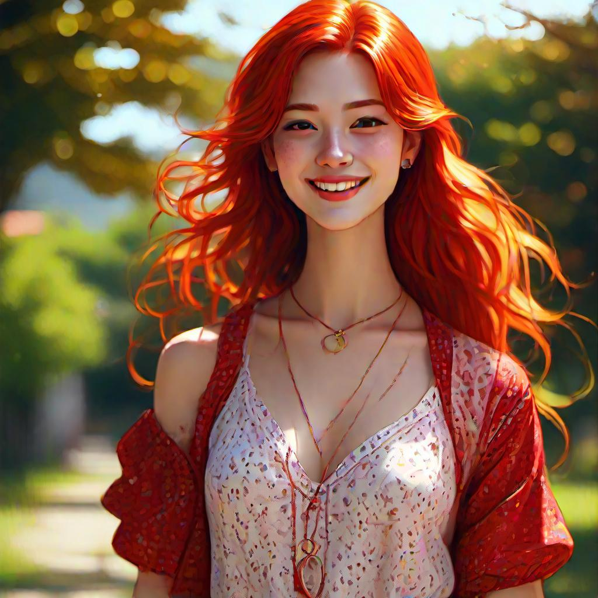
        </td>
        <td style="text-align: center; margin: 10px;">
            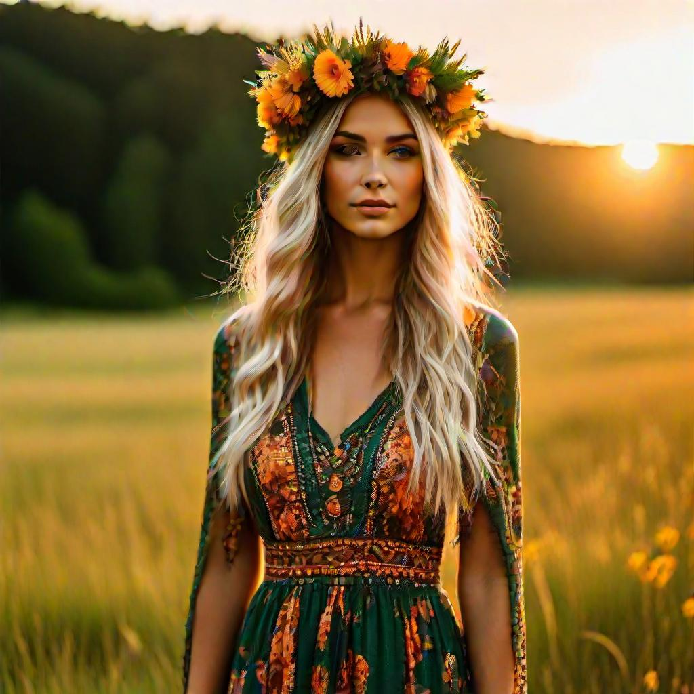
        </td>
        <td style="text-align: center; margin: 10px;">
            
        </td>
    </tr>
</table>

<div align="center">
    <p>3-Steps Sampling</p>
</div>
<table>
    <tr>
        <td style="text-align: center; margin: 10px;">
            
        </td>
        <td style="text-align: center; margin: 10px;">
            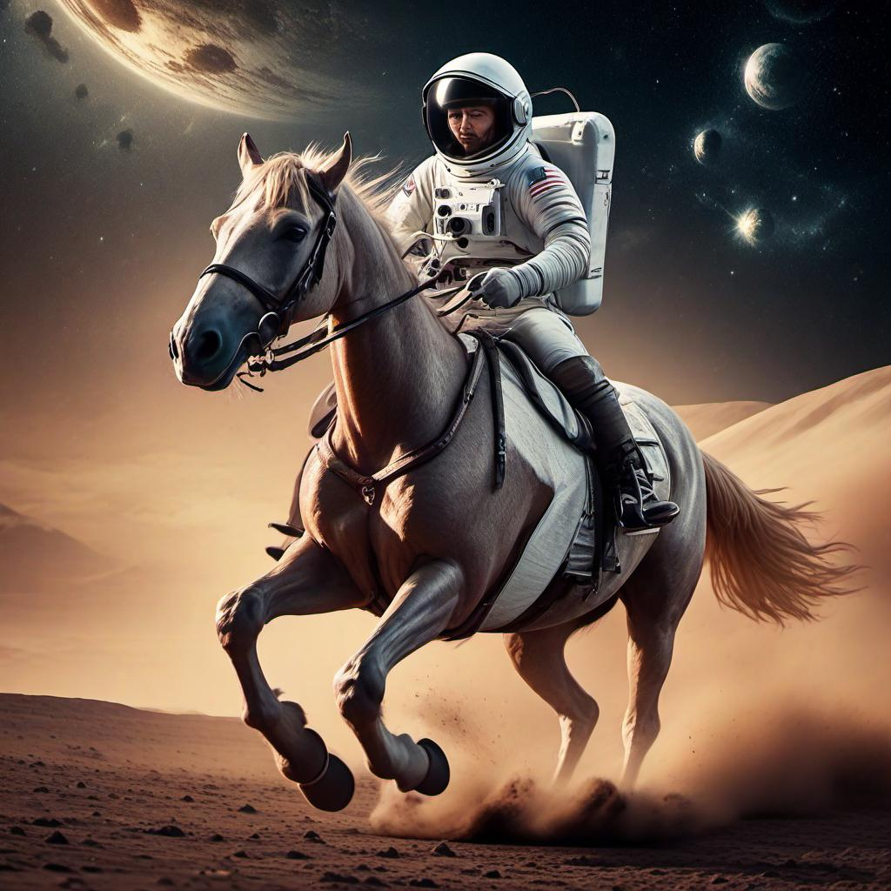
        </td>
        <td style="text-align: center; margin: 10px;">
            
        </td>
        <td style="text-align: center; margin: 10px;">
            
        </td>
    </tr>
</table>

<div align="center">
    <p>4-Steps Sampling</p>
</div>
<table>
    <tr>
        <td style="text-align: center; margin: 10px;">
            
        </td>
        <td style="text-align: center; margin: 10px;">
            
        </td>
        <td style="text-align: center; margin: 10px;">
            
        </td>
        <td style="text-align: center; margin: 10px;">
            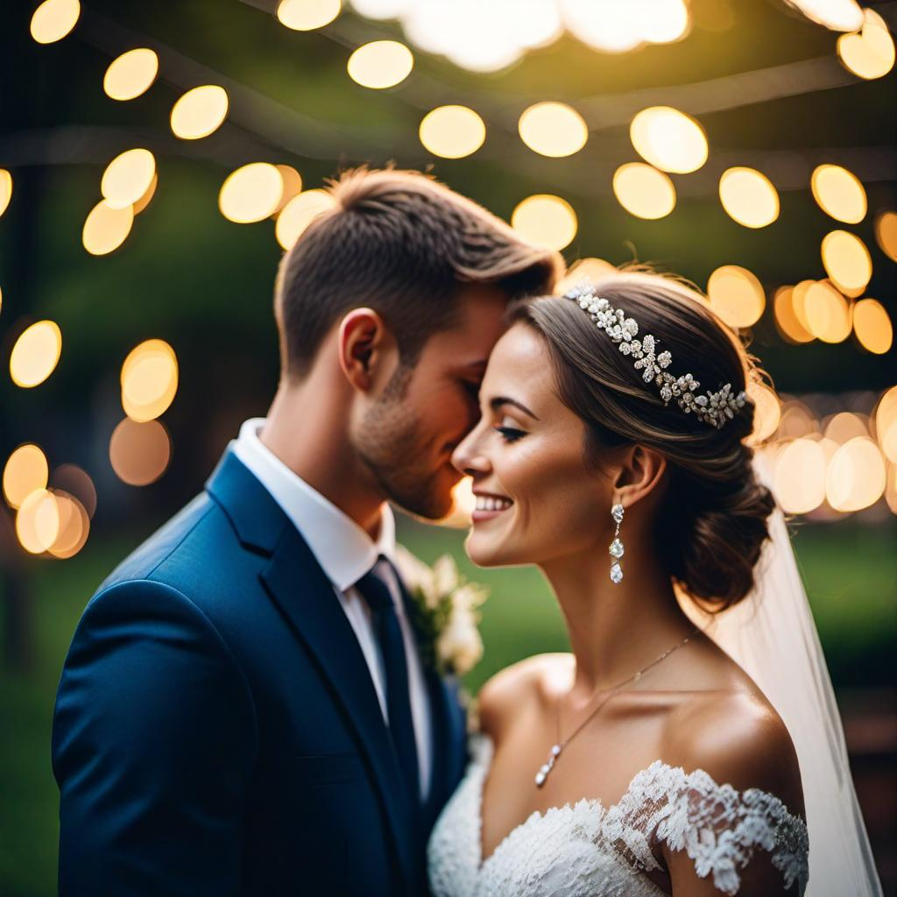
        </td>
    </tr>
</table>

<div align="center">
    <p>8-Steps Sampling</p>
</div>
<table>
    <tr>
        <td style="text-align: center; margin: 10px;">
            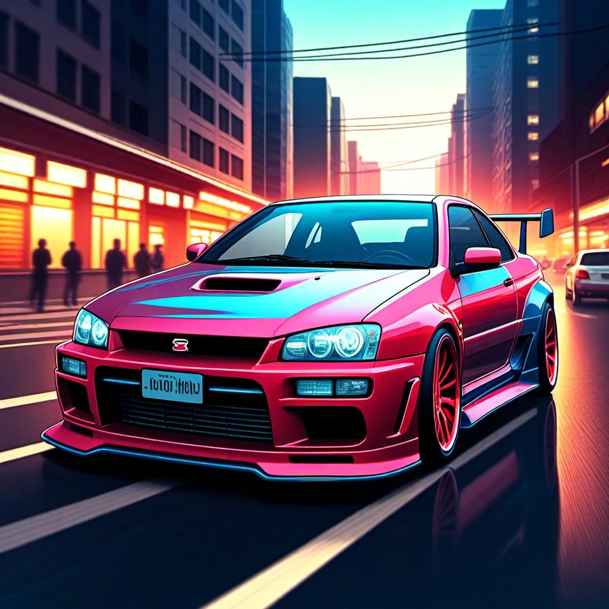
        </td>
        <td style="text-align: center; margin: 10px;">
            
        </td>
        <td style="text-align: center; margin: 10px;">
            
        </td>
        <td style="text-align: center; margin: 10px;">
            
        </td>
    </tr>
</table>

We also present some examples based on **FLUX**.
<div align="center">
    <p>3-Steps Sampling</p>
</div>
<table>
    <tr>
        <td style="text-align: center; margin: 10px;">
            
            <br>
            <span style="font-size: 12px;">Female journalist...</span><br>
            <span>eyes behind glasses...</span>
        </td>
        <td style="text-align: center; margin: 10px;">
            
            <br>
            <span style="font-size: 12px;">A grand hallway</span><br>
            <span style="font-size: 12px;">inside an opulent palace...</span>
        </td>
        <td style="text-align: center; margin: 10px;">
            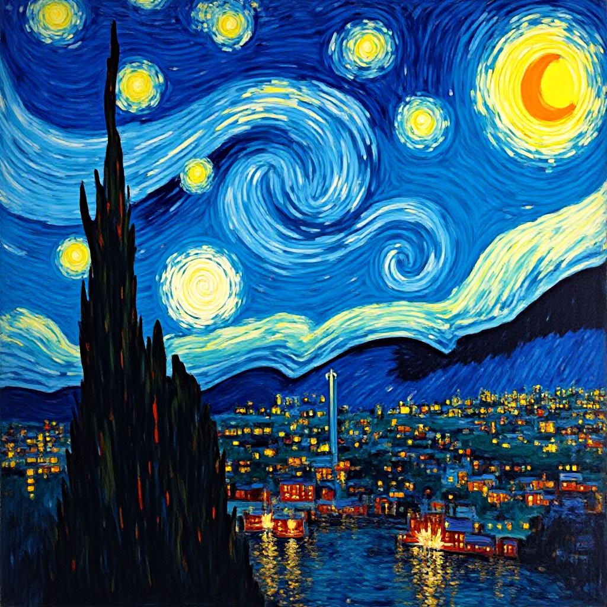
            <br>
            <span style="font-size: 12px;">Van Gogh’s Starry Night...</span><br>
            <span style="font-size: 12px;">replace... with cityscape</span>
        </td>
        <td style="text-align: center; margin: 10px;">
            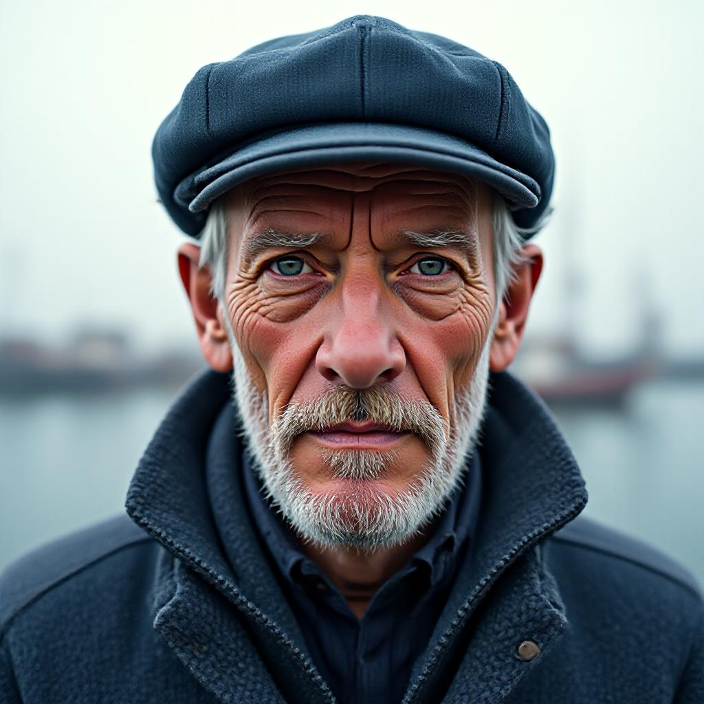
            <br>
            <span style="font-size: 12px;">A weathered sailor...</span><br>
            <span style="font-size: 12px;">blue eyes...</span>
        </td>
    </tr>
</table>
<div align="center">
    <p>4-Steps Sampling</p>
</div>
<table>
    <tr>
        <td style="text-align: center; margin: 10px;">
            
            <br>
            <span style="font-size: 12px;">A guitar,</span><br>
            <span style="font-size: 12px;">2d minimalistic icon...</span>
        </td>
        <td style="text-align: center; margin: 10px;">
            
            <br>
            <span style="font-size: 12px;">A cat</span><br>
            <span style="font-size: 12px;">near the window...</span>
        </td>
        <td style="text-align: center; margin: 10px;">
            
            <br>
            <span style="font-size: 12px;">Close up photo of a rabbit...</span><br>
            <span style="font-size: 12px;">forest in spring...</span>
        </td>
        <td style="text-align: center; margin: 10px;">
            
            <br>
            <span style="font-size: 12px;">...urban decay...</span><br>
            <span style="font-size: 12px;">...a vibrant cherry blossom...</span>
        </td>
    </tr>
</table>

<div align="center">
    <p>6-Steps Sampling</p>
</div>
<table>
    <tr>
        <td style="text-align: center; margin: 10px;">
            
            <br>
            A cute dog<br>
            <span style="font-size: 12px;">on the grass...</span></span>
        </td>
        <td style="text-align: center; margin: 10px;">
            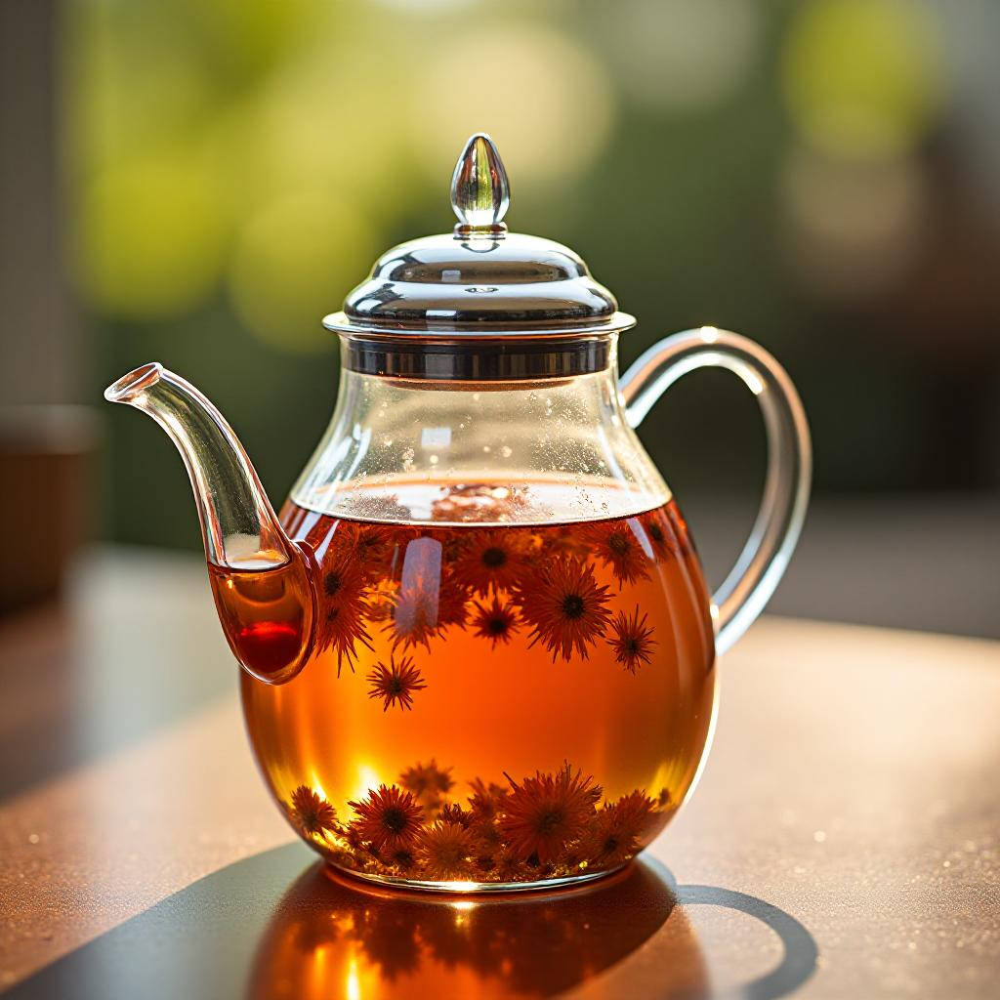
            <br>
            <span style="font-size: 12px;">...hot floral tea</span><br>
            <span style="font-size: 12px;">in glass kettle...</span>
        </td>
        <td style="text-align: center; margin: 10px;">
            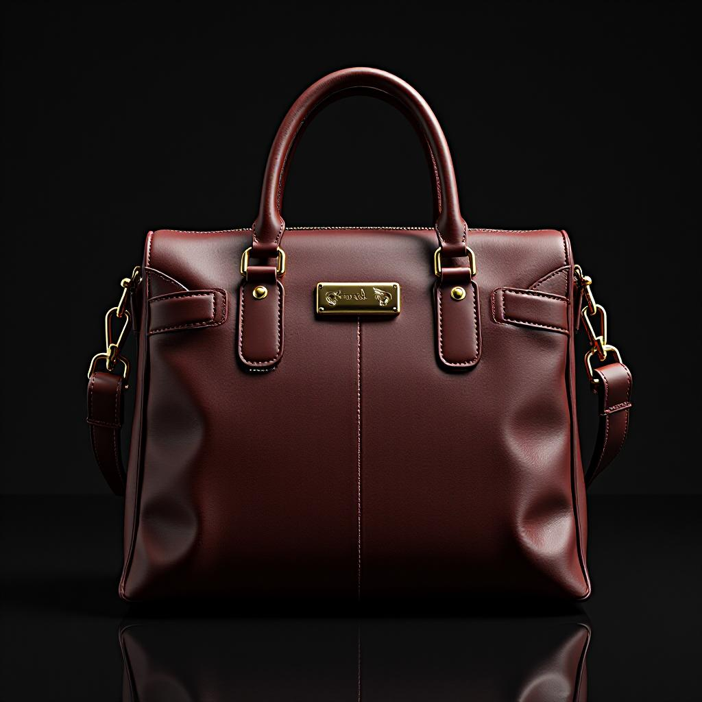
            <br>
            <span style="font-size: 12px;">A bag...</span><br>
            <span style="font-size: 12px;">luxury product style...</span>
        </td>
        <td style="text-align: center; margin: 10px;">
            
            <br>
            <span style="font-size: 12px;">A master jedi cat...</span><br>
            <span style="font-size: 12px;">wearing a jedi cloak hood</span>
        </td>
    </tr>
</table>

<div align="center">
    <p>8-Steps Sampling</p>
</div>
<table>
    <tr>
        <td style="text-align: center; margin: 10px;">
            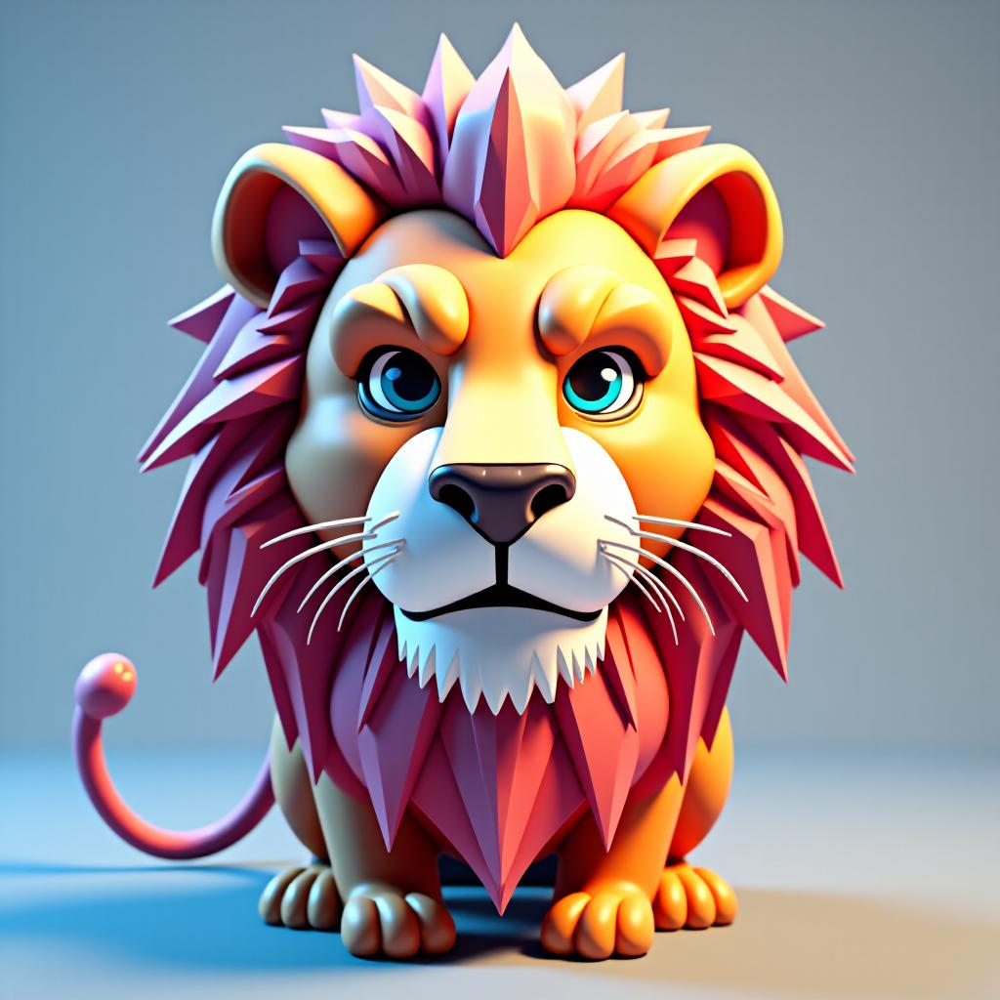
            <br>
            <span style="font-size: 12px;">A lion...</span><br>
            <span style="font-size: 12px;">low-poly game art...</span>
        </td>
        <td style="text-align: center; margin: 10px;">
            
            <br>
            <span style="font-size: 12px;">Tokyo street...</span><br>
            <span style="font-size: 12px;">blurred motion...</span>
        </td>
        <td style="text-align: center; margin: 10px;">
            
            <br>
            <span style="font-size: 12px;">A tiny red dragon sleeps</span><br>
            <span style="font-size: 12px;">curled up in a nest...</span>
        </td>
        <td style="text-align: center; margin: 10px;">
            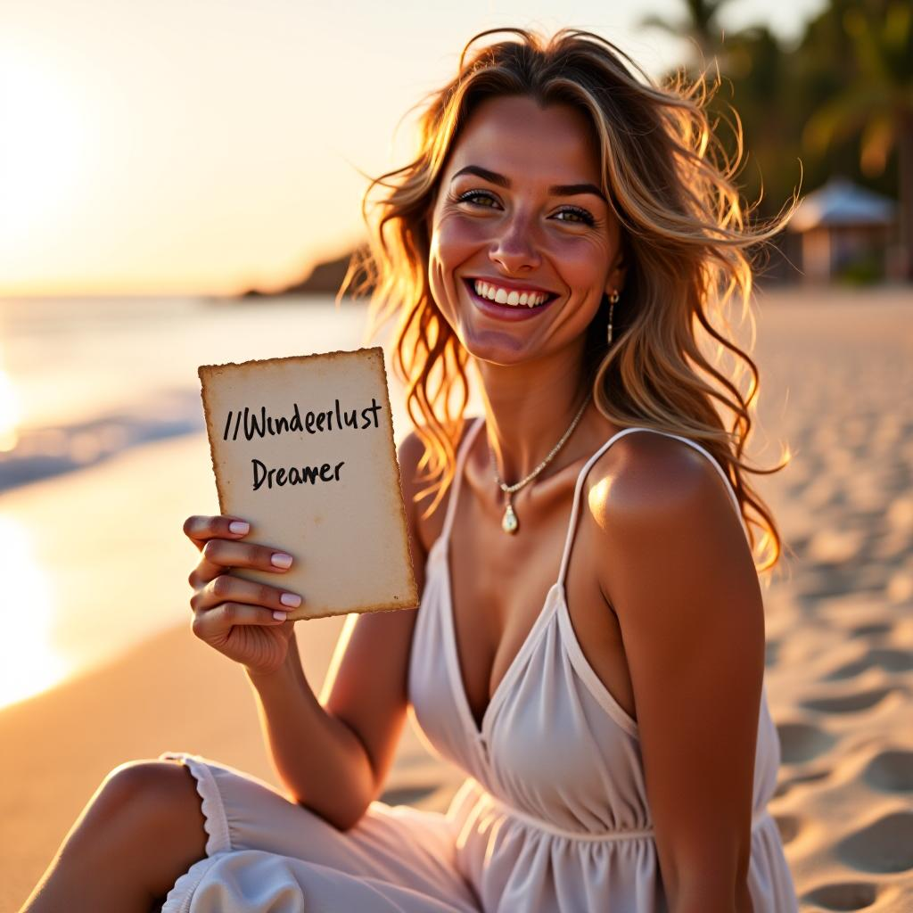
            <br>
            <span style="font-size: 12px;">A female...a postcard</span><br>
            <span style="font-size: 12px;">with "WanderlustDreamer"</span>
        </td>
    </tr>
</table>


## Addition

We also provide the latent lpips model [here](https://huggingface.co/OPPOer/TLCM). 
More details are presented in the paper.

## Citation

```
@article{xie2024tlcm,
  title={TLCM: Training-efficient Latent Consistency Model for Image Generation with 2-8 Steps},
  author={Xie, Qingsong and Liao, Zhenyi and Deng, Zhijie and Lu, Haonan},
  journal={arXiv preprint arXiv:2406.05768},
  year={2024}
}
```